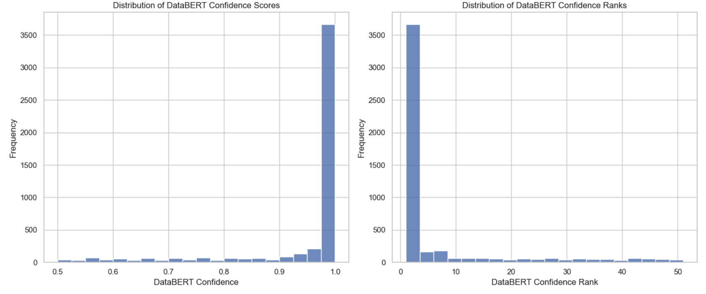
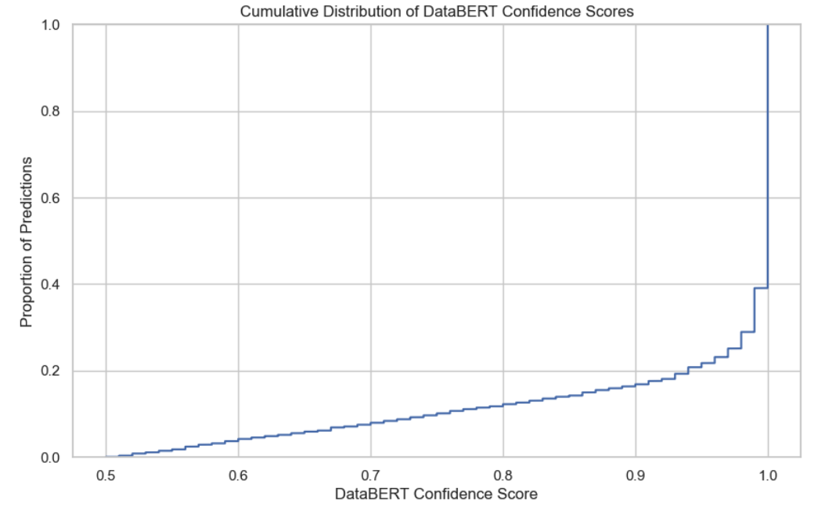
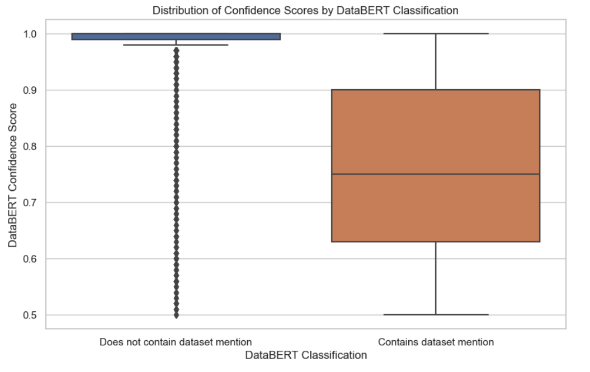
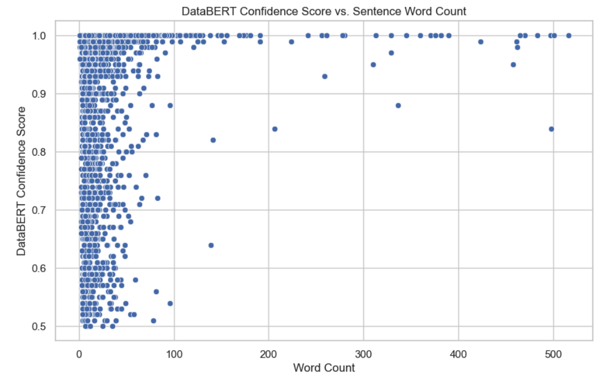
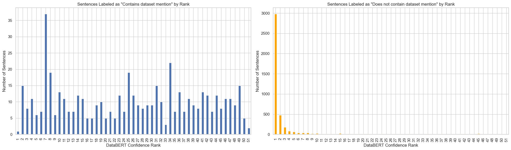
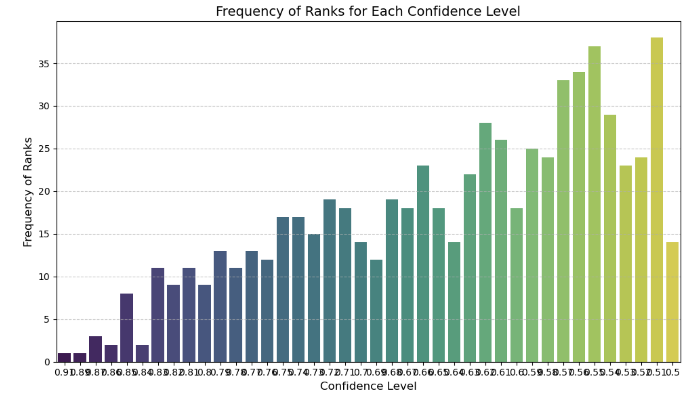

# PWRP Analysis

This part is dedicated to using DataBERT to perform inference on PWRP documents. 

Before doing this, we revisited the fine-tuning of BERT in 3 different manners in regards to the data:

1. Stratifying by both `label` and `paper_id` in the training data, which leads us to having both real and synthetic data in both training and validation sets. This gave us the best performance, and is the final model that we used. 

2. Creating a balanced dataset in terms of *labels* across train and test, but splitting the data between synthetic and real across train and test. This also gave good results across all metrics, but also in terms of performance on PWRP data. 

3. Same as 2, but relaxing the balanced dataset requirement in order to have more data. In this scenario, the optimizer gets stuck at a local minimum and fails to exit it, resulting in very low classification accuracy, and very bad performance on PWRP. 

### Splitting in terms of real and synthetic data: imbalanced dataset

We implement method 2, taking care of monitoring the ROC-AUC metric in this case as opposed to the ones we were monitoring previously. We recall briefly what this metric entails:

- **ROC Curve**: The Receiver Operating Characteristic (ROC) curve is a graphical plot that illustrates the diagnostic ability of a binary classifier as its discrimination threshold is varied. It plots the True Positive Rate (TPR, or recall) against the False Positive Rate (FPR, 1 - specificity) at various threshold settings.

- **AUC (Area Under the ROC Curve)**: The AUC represents the probability that a randomly chosen positive example is ranked higher (has a higher predicted probability) than a randomly chosen negative example. AUC values range from 0 to 1, where a model with no discriminative ability has an AUC of 0.5, and a perfect model has an AUC of 1.

In regard to our context, the reasoning behind monitoring this metric is the following:

- **Threshold Independence**: ROC-AUC is useful in imbalanced classification because it evaluates the model's performance across all possible classification thresholds, providing a comprehensive view of its performance.

- **Class Distribution Insensitivity**: The ROC-AUC is not affected by the change in class distribution. The ROC-AUC remains a consistent measure, enabling us to compare model performance reliably across different data sets or data subsets.

- **Evaluation of Ranking**: Especially in applications like ours, where it's crucial to distinguish between subtle cues indicating dataset mentions, the ability of the model to rank positive samples higher than negative ones is more informative than merely predicting classes directly. ROC-AUC directly quantifies this capability.

In order to achieve good ROC-AUC performance, we carry out a rigorous hyperparameter gridsearch:

```python
param_grid = {
    'learning_rate': [5e-7, 5e-8, 5e-5, 3e-5, 2e-5],
    'batch_size': [16, 32],
    'epochs': [2000],
    'optimizer_type': ['AdamW', 'SGD', 'RMSprop', 'Adam']  
}
```

Additionally, we implement early-stopping in regard to the ROC-AUC metric: we set a patience of 3, meaning that if the metric does not improve for 3 consecutive epochs, we stop the training and restore the weights of the best epoch.

At this stage, the maximum ROC-AUC score that we are able to achieve is $77.90$.


# Analysing the Performance of the Model on a sample of 50 PWRP papers

To perform this analysis, we invoke the fine-tuned BERT Classifier (DataBERT) on a sample of 50 PWRP obtained from the World Bank API. It returns a classification of approximately 4.5K sentences and returns these relevant metrics:

- `DataBERT_class`: binary classification as to if this sentence contains a dataset mention or not. 
- `DataBERT_confidence`: confidence score regarding this classification

We then proceed to ranking the dataframe by confidence score in the predictions with the `dense` method, giving us the `DataBERT_confidence` metric. 

## Analysing confidence distribution



**Confidence Score Distribution**: The first plot shows that the majority of the confidence scores are very high (close to 1.0), indicating that DataBERT is generally very confident in its predictions. However, this could also suggest a potential bias toward certain classes, or it might indicate that the model is overconfident.

**Confidence Rank Distribution**: The second plot visualizes the distribution of confidence ranks. Since the ranks are dense, many sentences share the same high confidence level. This distribution could imply that while the model differentiates between different levels of confidence to some degree, there's a significant concentration of sentences at the highest confidence level.
 
 

- **Proportion of High-Confidence Predictions**: The plot shows a rapid increase toward the higher end of the confidence score spectrum, indicating that a substantial proportion of the model's predictions are made with high confidence (scores close to 1.0). This suggests that DataBERT is generally very confident in its classifications.

- **Threshold Analysis**: By examining specific points on the CDF, we determine what proportion of predictions are made above certain confidence thresholds. For instance, we might want to know what fraction of the predictions have a confidence score above 0.9 or 0.95. The closer this curve is to the top-right corner, the higher the proportion of such high-confidence predictions.

- **Confidence Score Diversity**: The smoothness of the curve across different confidence levels indicates the diversity in the model's confidence scores. If the curve were to have steps or less smooth transitions, it would suggest clusters of predictions around certain confidence levels.

- **Low-Confidence Predictions**: The left part of the plot (closer to zero) shows the proportion of predictions made with lower confidence. In this plot, it appears that only a very small fraction of predictions have low confidence scores, indicating that the model is seldom very uncertain.

## Confidence score by classification



- **Confidence Range**: The plot illustrates that the range of confidence scores appears similar for both classes, indicating that the model does not exhibit a strong systematic bias toward being more confident in one class over the other. However, further statistical testing could confirm if any observed differences are significant.

- **Interquartile Range (IQR)**: The IQR, represented by the box length in each category, appears comparable for both classes, suggesting that the model has a similar level of variability in its confidence for both "contains dataset mention" and "does not contain dataset mention."
Median Confidence: The line inside each box indicates the median confidence score. If these lines are at similar heights for both classes, it suggests that the model's central tendency in confidence is consistent across classifications.

- **Outliers**: If any points are plotted as outliers (far from the main boxes), these represent sentences where the model's confidence significantly deviates from the norm for its class. The presence and quantity of such outliers can indicate the extent to which the model's confidence varies within each class.

## Does sentence length matter?

This part of the analysis is relevant in regard to the "splitting" of the data. Our `DocumentProcessor` class is responsible for this aspect, and for the time being is not 100% robust in identifying full sentences as it splits sentences on ".", which, due to citations in research papers, can result in very short sentences. 



- **Confidence Across Different Sentence Lengths**: The plot does not show a clear trend or correlation between sentence length (word count) and confidence score, indicating that the model's confidence does not consistently increase or decrease with longer or shorter sentences. This suggests that sentence length alone is not a significant determinant of model confidence for DataBERT.

- **Variability in Confidence**: The plot displays a wide distribution of confidence scores across various sentence lengths, with a concentration of high-confidence scores at various word counts. This variability suggests that factors other than word count are more pivotal in determining the model's confidence.

- **High-Confidence Concentration**: There is a noticeable concentration of sentences with high confidence scores across different word counts, reinforcing the model's overall tendency towards high confidence, as observed in the previous analyses.


# Analysing Performance across various confidence levels

The goal of this section is to evaluate how well the model performs across confidence categories essentially answering the question: "down to which confidence level can I still trust the prediction"?

We start by plotting the classification as a function of the rank given by the model. The positive sentences seem to fluctuate as a function of the rank with no clear pattern, with the highest number of positive sentences given at the rank of 7. Inversely, the model seems to be most confident at detecting negatives, as seen by the right plot. 



- `DataBERT_confidence_rank` = 1:

Surprisingly, despite this being the most common rank, the model seems to perform very well in terms of **accuracy**. The vast majority of classifications are negatives, and we were only able to identify one False Negative which probably occurs as the model is not yet familiar with advanced research terminology especially related to surveys:

*Because the Annual Survey of \nIndustries is structured as a rotating panel for the majority of the plant size di stribution , we limit the sample \nto the set of plants observed in the data in the five years prior to their nearest GQ segment being completed, \nthereby halving the number of observations.**

Apart from this specific instance, the rest of the negatives are true negatives. We are also able to identify one True Positive which is particularly complex:

*'Using data collected from\\n2,320 taxpayers for 2011 and 2012, the study uncovered valuable insights into\\nthe dynamics of the tax system.\\nThe findings suggest that while the tax policy itself is not explicitly bi-\\nased, gender disparities in tax declaration and enforcement processes have\\nemerged.'*

- `DataBERT_confidence_rank` = 2:

This is when the model starts to significantly identify positives with a confidence of 0.99. These tend to be more obvious thanpreviously with two categories.

1 - The sentence explicitly mentions usage verbs and data sources:

*'Data  and methodology  \\n \\n3.1 Data  \\nThe analysis uses t wo rounds of the Ethiopia Socioeconomic Survey (ESS)...*

2 - Short sentence probably at the end of a larger sentence which directly specifies a data source with the words: "Source":

*'Source: WGI database for political \\nstability  indicator and WDI database for database for GDP per capita.'*

- `DataBERT_confidence_rank` = 3:

At this level, the model starts taking more risks. The sentences become less and less obvious, with no direct mentions of datasets but just data from various sources e.g.,

*'Section 2 reviews the structure of\\nEthiopia’s tax policy and its implication for gender differences relying on the\\nliterature on gender and taxation.'*

- `DataBERT_confidence_rank` = 4, 5, 6, 7,8:

The model starts making mistakes, as it identifies formats that it hasn't seen before (usually e-mails) as datasets e.g., 

*'The author \\nmay be contacted at hkomatsu@worldbank.org.'*

One may still be able to use this inference by hardcoding a guardrail against the e-mail format.  

However, it is still making accurate predictions:

*'For the\\nelasticities of substitution, we use the estimates from Krusell et al.'*

- `DataBERT_confidence_rank` = 9, 10, 11, 12, 14, 15, 16, 17, 18, 19:

Model stops making blatant mistakes, but now starts to identify only sources where it can see the words "Source", implying that it is taking lower and lower risk:

*\\nSource: World Bank Enterprise Surveys \\nhttps://www.enterprisesurv eys.org/en/enterprisesurveys*

The format that here is more apparent in the detection is URLs to other data sources. This is particularly visible given the fact that it mentions this in the detection:

*'Retrieved from: \\n http://www.christianaid.org.uk/resources/policy/occasional_paper_series.aspx*

These become less and less relevant here as they seem to be taken directly from the bibliography. 

- `DataBERT_confidence_rank`= 20, 21:

Still some good examples, but now starts to confuse actual metrics with datasets:

*'These include  labor  productivity \\nand growth rate of sales and employment ( see Allison et al.'*

It also starts placing an emphasis on titles:

*'“ Women at the Top in Developing \\nCountries: Evidence from Firm -Level Data ” IZA Discussion Papers  9537, Institute of Labor \\nEconomics (IZA).'*

- `DataBERT_confidence_rank` = 22-34:

We start having more bad examples than good ones, but still have some good examples if filtered e.g., *'Variables, data needs and sources for economic assessment of HAIs  \\nCost variable  Data needs  Data value or range...*

- `DataBERT_confidence_rank` = 35 onwards:

Very few (if any) good examples. Confidence at this level is 66%. 


# Evaluating DatastilBERT v2 against PWRP dataset



Looking at the plot, we can see that the model is extremely conservative with the vast majority of predictions being low confidence. 

We then proceed to eyeball the various ranks:

**Rank = 1**:

```bash
"\\n  POLICY RESEARCH         W\\nORKING PAPERSTRANSPARENT\\nANALYSIS', 'P\\nresumptive Tax  on Small and Micro enterprises with a Gender Lens in Ethiopia1 \\nHitomi Komatsua  \\nKeywords: Presumptive tax, taxation, gender, Ethiopia \\nJEL: H22, H25, J16 \\n1 This study was  supported by the World Bank’s Global Tax Program."
```

This sentence may very well be a False Positive. The issues here that may confuse the model are:
- The structure, with all the new line characters that splits up words
- This specific part of the sentence: "This study was  supported by the World Bank’s Global Tax Program."

In further iterations, we may want to consider "tricking" the model using similar sentences, for it to better distinguish various across various levels of vocabulary.

**Rank= 2, 3, 4, 5, 6**:

Perfect examples:

```bash
'T he study uses newly available data on household nonfarm enterprises  from the 2018/2019 and \\n2021/2022 Ethiopian Socioeconomic Survey s (ESS)  and the tax code to impute tax liabilities.'
'Using citation data from the Google Scholar platform , this study revealed  the heterogen eous quality of \\nthe research  products  selected.'
"Data description and main variables \\n3.1 Data sources  \\nOur primary data source consist s of firm -level survey data collected by the World Bank's \\nEnterprise Surveys ( WBES)."]
```

**Rank = 6, 7, 8, 9, 10, 11, 13**:

Still some good detections (from rank 11):

```bash
'Using data collected from\\n2,320 taxpayers for 2011 and 2012, the study uncovered valuable insights into\\nthe dynamics of the tax system.\\nThe findings suggest that while the tax policy itself is not explicitly bi-\\nased, gender disparities in tax declaration and enforcement processes have\\nemerged.'
```

Issues with bibliography or title detections:

```bash
'(2015) “Firm Dynamics, Productivity Growth, and Job Creation in Developing Countries: The Role of Micro- and Small Enterprises,” World Bank Research Observer,  30(1): 3 – 38 \\n Martin, L., S. Nataraj, S., and A. Harrison.'
'(2015b)  “A Detail ed Anatomy of Factor Misallocation \\nin India,” World Bank Policy Research Working Paper No.'
```

**Rank = 14, 15**:

Starts detecting "low-hanging fruit" that start with "Source":

```bash
'Protests and demonstrations in Africa  \\n    \\nSource:  Armed Conflict Location & Event Data Project (ACLED).'
```

**Rank = 16, 17, 18, 19, 20, 21, 22, 23, 24**:

Still some confusion with entity names:

```bash
'World Bank Policy Research Working Paper, (8065)'.
```

A lot of titles and references at this point, but still good examples. 


**Rank 25 onwards**:

30% correct. 


 


