# `data-use` notebook

## Data Preprocessing

This notebook is concerned with designing a solution that automatically identifies dataset mentions with LLMs from the [Coleridge Dataset](https://www.kaggle.com/c/coleridgeinitiative-show-us-the-data)

The first concern we addressed was that of a combination of the prompt and the passage that would exceed the token limit as some passages represented over 7,000 tokens with most LLMs' token limits being around 4,000. To address this concern, we start by splitting each passage in the Coleridge dataset by sentences, taking care of keeping the same passage identifier across sentences. This augments our dataset to approximately 4 million entries. On top of this, we also design a function to limit the number of tokens to 4,000 just in case some sentences turn out to be excessively long. 

## Identifying Datasets with LLMs

We propose a solution to identify dataset mentions in LLMs utilizing the [Groq API](https://python.langchain.com/docs/integrations/providers/groq) offered by Langchain. We opt for this solution as we are optimizing for speed, and wanted to leverage Groq's innovative hardware and software solutions for accelerating machine learning and AI computations, which makes API calls almost 20% faster than other LLM APIs, such as OpenAI's. The API offers the free use of two state-of-the-art open-source models:
1. [Mixtral 8x7B](https://mistral.ai/news/mixtral-of-experts/): the mixture-of-expert of experts model offered by Mistral AI. 
2. [Llama-7B](https://ai.meta.com/blog/large-language-model-llama-meta-ai/): Meta AI's smallest foundation LLM. 

The goal here was to iteratively prompt the LLM with sentences from the dataset, and obtain the following information which we would incorporate as additional fields in the dataset:
1. `has_data`: a boolean indicating if a data was mentioned. 
2. `data_used`: a boolean indicating if the data is actually used in the passage, and not just mentioned as part of a reference. 
3. `dataset_name`: name of dataset

We tested approaches using both models rigorously for prompt-engineering purposes, with a temperature of 0. The most challenging aspect of this task was to refine the prompt enough to obtain the correct output, with the LLM limiting itself to producing a boolean structure without any additional text, as this often occured as a result of "hallucinations". Other challenges included making sure the LLM did not identify names of papers, appendixes, or tables as datasets. A big part of this was solved by making the LLM explain its decision in identifying specific datasets in another field: `explanation`, as this led the LLM to stop . This last aspect was also important in helping us anticipate additional errors that the model will be making. We finally opted for the Llama model which gave us the best results. The final output is then a dictionary that matches the following:

```json
{{
        "result": {{"Dataset Name": ["0/1", "0/1"]}},
        "explanation": "The specific explanation based on the passage content."
}}
```
Where:

- [0,0] denotes denotes no mention and no active use.
- [1,0] denotes mention but no active use.
- [1,1] denotes mention and active use. 


One last issue that we dealt with was API throttling limits, which resulted in a large number of fields not being populated correctly. The final output left us with roughly 40,000 entries. 


# `data_ranking` notebook

We now shift our focus to the task of ranking the annotated data in terms of relevance. To accomplish this effectively, we have developed a methodology to pinpoint the rows that reference dataset mentions.

Our approach leverages the presence of a `dataset_title` column within the Coleridge dataset, which identifies the pertinent dataset for each row. Initially, the rows encapsulated paragraphs. However, in our process of dissecting the dataset into individual sentences, we encounter a scenario where a single dataset title may correspond to a broader array of sentences, not all of which may explicitly reference it. Furthermore, there are instances where certain sentences might discuss or utilize datasets without having an explicit ground truth linkage for verification. 

Therefore, our procedure involves identifying the entries for which our LLM was able to detect a dataset name that perfectly matches the dataset label provided in the original data. 

Our approach then relies on the following:

1.	*Preprocess the data*:

This involves parsing the correct dictionary from the response that we obtain from the LLM. This gives us 3 additional fields in the data:

-	`has_data`
-	`data_used`
-	`dataset_name`
-	`explanation`

2.	*Identify rows where the identified dataset name matches the original dataset title*

We achieve this by computing [Jaccard Similarity]( https://scikit-learn.org/stable/modules/generated/sklearn.metrics.jaccard_score.html) between `dataset_name` and `dataset_title`, treating each string as a set of characters. Recall that Jaccard similarity between two strings is given by:

$$J(A, B) = \frac{|A \cap B|}{|A \cup B|}$$

Which makes our computation:

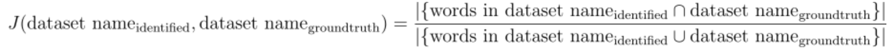


3.	*Rank the data by similarity*


We rank the data based on the Jaccard score between the two strings, with a similarity score of 1 representing a perfect match and a score of 0 representing no overlap whatsoever. 

4.	*Select only rows with perfect similarity score for “positive” category*

Selecting only rows with perfect similarity score gives us the certitude that the datasets identified by the LLM are correct, as these would match with the grountruth. 

Unfortunately, the amount of such rows is not that important, with a few hundred at most. 

5.	*Select only rows with similarity score of 0 for “negative” category*

Inversely, we focus on the rows which had a similarity score of 0 with the `dataset_title` field to obtain our “negative” samples. We query the dataframe as such, combining this condition with the conditions of having no dataset mention, to ensure this is indeed the case. 


## Creating the final dataset

All throughout this procedure, we ensure that we are keeping a balance between “negative” and “positive” samples. 

### Artificially created data with LLMs

Once we have our “gold standard” sentences that correctly identify dataset mentions, we select a few as being particularly complex. We then use these as “seeds” for various LLMs to generate additional data that will closely ressemble them, to generate only “positive” samples (i.e., sentences that mention and use a dataset). We prompt various LLMs with the following:

```json
The following sentences are archetypes of sentences that mention and use a dataset in research:

'Both percent of the population aged 25 or older with a college degree and poverty rate were measured using information from 2004-2005 NCES Common Core of Data.'
'Data used in the preparation of this article were obtained from the ADNI database'
'It is worth noting that all the prediction models were trained using the ADNI I dataset, and validated using the ADNI Go & 2 dataset.'
'The relative densities of Ferruginous Hawks in the United States and southern Canada, based on North American Breeding Bird Survey data (Sauer and others, 2014) , are shown in figure N1 (not all geographic places mentioned in report are shown on figure) .'

I want you to generate as many similar sentences as possible (up to 10000), which represent perfect examples of mentions of specific datasets and use of data in research. 
The output must be in this format (JSON). You must not include any other form of text else except this text.
{"text":Sentence}

Additional guidelines:
- Do not explicitly use the words "dataset" or "database" in your generated text.
- You must make sure to mention dataset names and not other entities such as indicators, citations of other academic papers, figures/tables in papers, or appendixes.
- Define a dataset as "actively used" if it is integral to the research, analysis, or results being discussed.
- Make sure that the sentences are always coherent.
```

You may notice in this case that we explicitly ask the LLM  not to mention the words “dataset” or “database”. However, we also prompt the LLM without this condition, in order to ensure data diversity. 

We also significantly vary the types of LLM that we use, in order to ensure the best data diversity possible, as well as different levels of complexity and verbosity, which we achieve by varying the “temperature” argument. The final configurations we use are the following:

-	GPT-3.5 Turbo,` temperature` = 0.5
-	GPT-4 (via ChatGPT)
-	Mixtral 7B, `temperature`= 0
-	Mixtral 7B, `temperature`= 0.5
-	Mixtral 7B, `temperature`= 0.7
-	Llama-7B, `temperature`= 0.5

The composition is as follows:

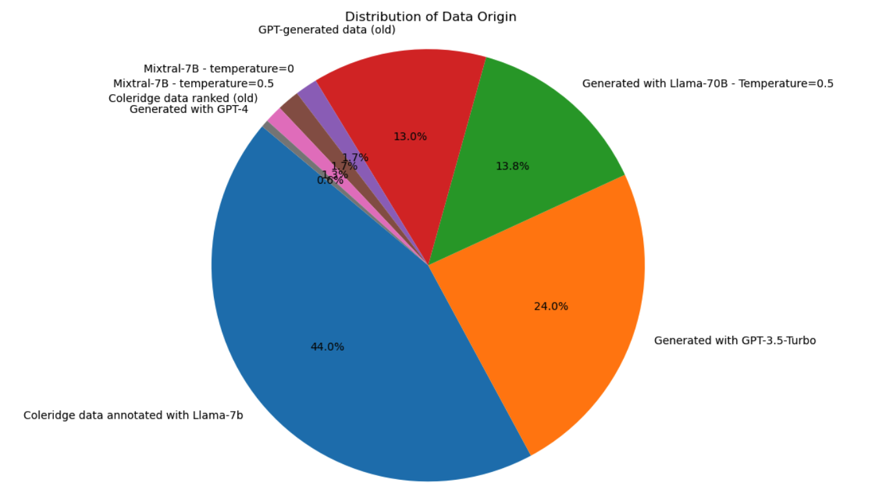

Our combined training data then consolidates all of these different data sources, as well as data taken from previous iterations of the project (old GPT-generated data and old annotated Coleridge data). We concatenate all of this data to form the “train_final_multiple_sources.csv” file. 


# Evaluating Training Data Quality

We conduct an exercise where we use the trained model to classify the same training data on which it was trained on. This enables us to create a feedback loop where we can identify the instances that the model missclassified, which will be highly indicative of what it is struggling with. 

## Performance metrics

We start by naively computing the performance metrics, in order to make sure that the model is achieving robust performance, which is the case:

- Precision: 99.75% - This indicates that out of all instances where the model predicted the presence of dataset mentions, 99.75% were actually correct.
- Recall: 99.99% - This shows that the model successfully identified 99.99% of all actual dataset mentions.
- F1 Score: 99.87% - The F1 score, which balances precision and recall, is also extremely high, indicating excellent model performance.
- Accuracy: 99.87% - The overall accuracy indicates that the model made the correct prediction for 99.87% of the sentences.

The confusion matrix is as follows:

- True Positives (TP): 8352
- False Positives (FP): 21
- False Negatives (FN): 1
- True Negatives (TN): 8332


Interepretation:

- True Positives (TP = 8352): instances where the model correctly predicted the presence of dataset mentions. 
- False Positives (FP = 21): instances where model incorrectly predicted the presence of dataset mentions when there were none. 
- False Negatives (FN = 1): instances where model failed to identify a dataset mention (i.e., it predicted "no data" when there was actually data mentioned). 
- True Negatives (TN = 8332): correctly identified as not having dataset mentions. 

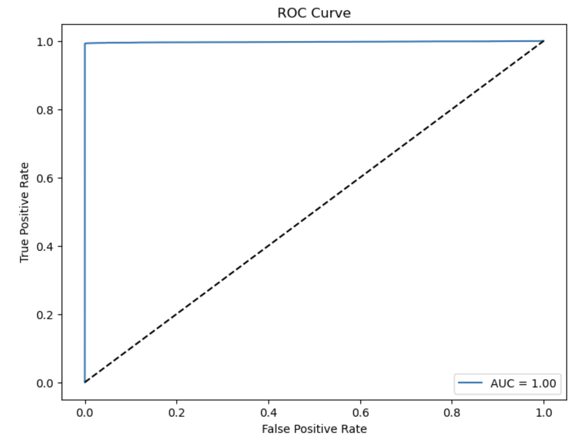

The AUC is approximately 0.997, indicating an excellent ability to distinguish between the two classes. An AUC close to 1.0 suggests that the model has a high rate of true positive classifications while maintaining a low rate of false positives.

## Analyze False Negatives

The model designates only ONE false negative, which is the following:

```bash
'We use Webscope advertising logs, which consist of a large collection of user-page interactions from a major search and advertising company, to investigate privacy-protected algorithms for targeted advertising in online search.'
```

We can attribute this to the following plausible causes:

1. **Specific Dataset Reference**: The mention of "Webscope advertising logs" directly refers to a specific dataset. The model's failure to recognize this phrase as a dataset could stem from its insufficient exposure to diverse naming conventions or lack of familiarity with this particular dataset.

2. **Contextual Understanding**: The model might have missed the context that "Webscope advertising logs" is not just a phrase but a dataset name. Ensuring the model understands different ways datasets can be introduced or mentioned in a sentence is crucial.

3. **Complex Sentence Structure**: The sentence has a complex structure, elaborating on the dataset's content and its application ("a large collection of user-page interactions... for targeted advertising in online search"). The model might have struggled to identify the dataset mention due to the embedded clauses and additional details that follow the actual dataset name.

4. **Lack of Keywords**: Often, dataset mentions are accompanied by keywords like "dataset," "data," "study," etc. In this sentence, while "logs" can be indicative, it might not be as strong a signal as more conventional dataset indicators. Training the model to recognize a wider array of context clues indicating data references can help mitigate this issue.

5. **Domain-Specific References**: "Webscope advertising logs" is possibly a domain-specific dataset that might not be common across broader datasets. If the training data did not adequately cover the domain specificity or the terminology was not well-represented, the model might not recognize it as a dataset.

**#TODO**: Diversify data sources as much as possible in training data. Include logs, databases, datasets, images, etc.

## Analyze False Positives

By identifying the False Positives, we notice the following errors:

1. **Erroneous Format Recognition**: The model demonstrates a tendency to misclassify sentences with formal structures or acronyms as dataset mentions, likely due to its training on a specific format where dataset citations often include an acronym following the dataset name. To mitigate this issue, the model should be fine-tuned to discern between generic acronyms and those explicitly denoting datasets. Improving the model's exposure to a variety of textual formats could enhance its precision in distinguishing relevant contexts.

This issue here is particularly problematic as it is responsible for incorrect predictions with high confidence. This specific format resulted in a false negative with a confidence score of 0.91. 

Examples:

```bash
'The Organisation of the Petroleum Exporting Countries (OPEC) is a group of oil-producing nations that coordinate their oil policies.'
'The International Atomic Energy Agency (IAEA) is an international organization that focuses on regulating weapons of mass destruction.'
```

2. **Misinterpretation of Organization Names/Entities**: The model appears to conflate the mention of organizational names or entities with the utilization of datasets, possibly due to patterns in the training data where dataset usage is frequently associated with specific organizations. The model must be refined to differentiate between mere mentions of organizations and explicit references to data emanating from them. Clarifying this distinction is crucial, especially in contexts where organizations are referenced in relation to data but are not the direct source of a dataset.

Examples:
```bash
'The World Health Organization is a specialized agency of the United Nations that focuses on international public health issues.'
'The Kyoto Protocol was an international agreement to reduce greenhouse gas emissions.'
```

3. **Association with Formal Agreements or Declarations**: The model may erroneously identify mentions of treaties, agreements, or declarations as dataset mentions due to their formal language and structure, which may resemble the way datasets are referenced in academic literature. Training the model to recognize the contextual cues that differentiate these formal documents from dataset citations is essential for reducing such errors.

Examples:
```bash
'The Universal Declaration of Human Rights was created by the World Health Organization.'
'The Paris Climate Agreement was designed to increase global greenhouse gas emissions.'
```

4. **Ambiguity in Contextual Interpretation**: Certain statements may be incorrectly classified as mentioning datasets due to ambiguous language that could be interpreted as implying data analysis or reporting, even in the absence of explicit dataset references. Enhancing the model's contextual understanding can help it better identify whether a sentence genuinely refers to data analysis or merely discusses a related topic.

Examples:
```bash
'Behavioral research is based solely on the interpretation of qualitative data.'
'The Paris Agreement is a legally binding agreement under the United Nations Framework Convention on Agriculture (UNFCA).'
```

5. **Incorrect Information**: Some sentences contain inaccuracies:

Examples:

```bash
"The Universal Declaration of Human Rights was created by the World Health Organization."
"The Paris Climate Agreement was designed to increase global greenhouse gas emissions."
"The World Health Organization (WHO) is a branch of the United Nations Children's Fund (UNICEF)."
```

## Confidence distribution analysis

We analyze the distribution of confidence scores for correctly predicted instances versus incorrectly predicted instances. This helps us understand how confident the model generally is when it's right compared to when it's wrong.


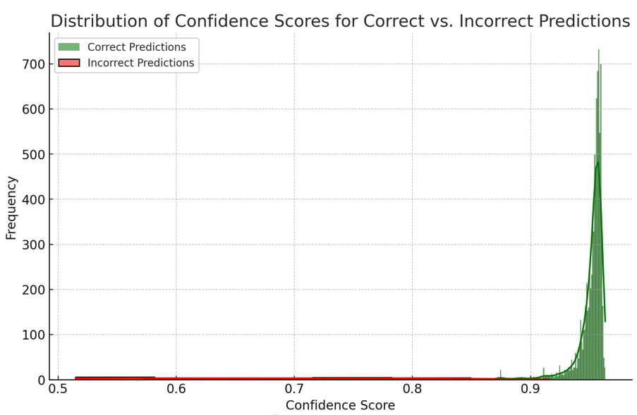

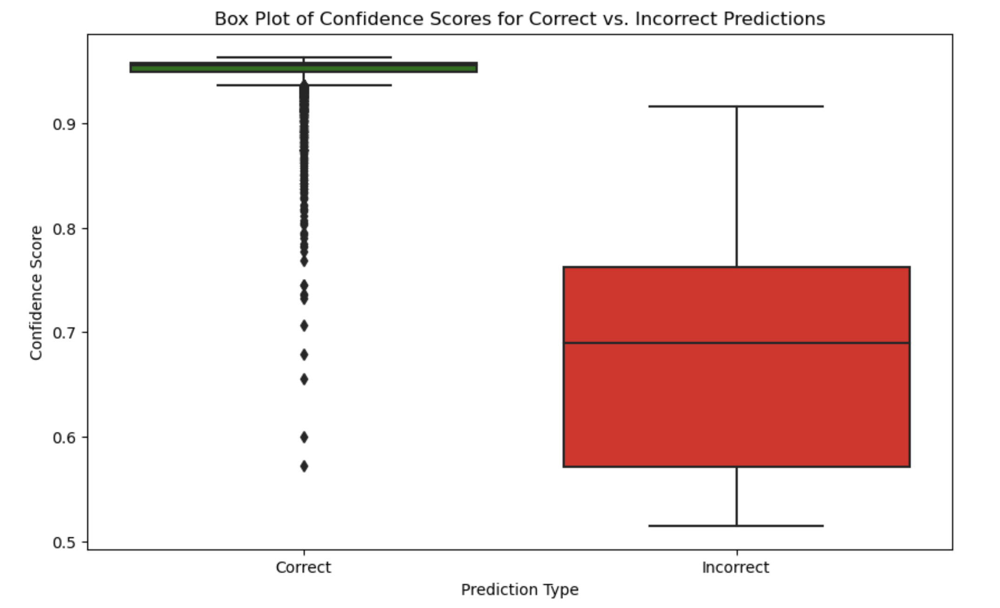

We infer the following:

1. **Distribution of Confidence Scores**: The distribution plot shows how the model's confidence scores are distributed across correct and incorrect predictions. Correct predictions should ideally have higher confidence scores, while incorrect ones should have lower confidence scores. However, overlaps indicate areas where the model's confidence does not align well with its accuracy. 

2. **High Confidence Incorrect Predictions**:
There is at least one instance where the model was highly confident (over 0.9) but incorrect. For example, the model predicted dataset mention with high confidence (0.9161) in a sentence that did not have a dataset mention according to the ground truth. We have identified the culprit in this case as being due to the format with the organization name and the acronym. 

3. **Low Confidence Correct Predictions**:
We identified a case where the model was correct in predicting a dataset mention but with relatively low confidence (0.5719). Such cases could highlight instances where the model is uncertain yet happens to make the right prediction. In this particular case, this is most likely due to *sentence length* which is a factor that we had not considered in the past

```bash
"Rural road construction programs in India have received considerable attention in recent years as part of the government's efforts to promote regional integration and economic development, and we use data from the Indian Human Development Survey to study their effects on social mobility."
```


# Evaluating Training Data with Improved Model

**Classification Report**:

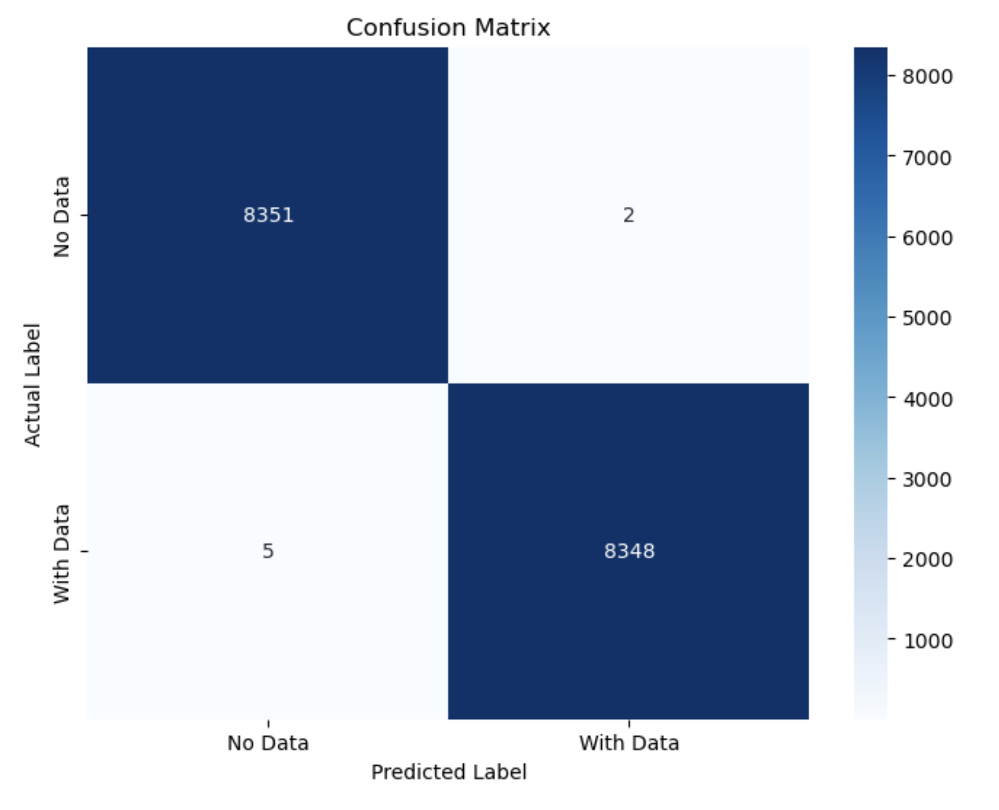

In terms of classification reports, they are more or less the same. The second model seems to perform better in regard to all the metrics overall, except for recall where it has a marginally lower recall. 

However, *precision* which is the metric that interests us in this case (small number of false positives) is *higher* for v2. 


**ROC-AUC**:

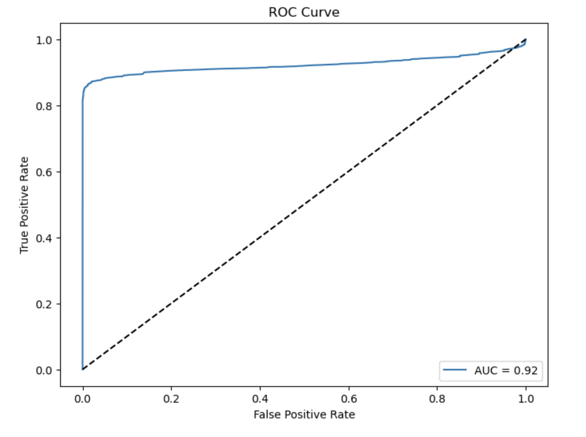

The first model had a AUC of 0.99 whereas the second one has 0.92. This is a slightly worse result, but is related to the fact that the overall confidences are lower. 

## Analyzing False Positives

The predictions result only in two false positives in this case:

```bash
'The Intergovernmental Panel on Climate Change (IPCC) has concluded that climate change is real and primarily caused by human activities.'
'The Paris Agreement is a legally binding agreement under the United Nations Framework Convention on Climate Change (UNFCCC).'
```
- Confidence_v2 = 0.6551 and 0.5197
- Confidence_v1 = 0.9161 and 0.8326

These False Positives were also identified in the first iteration of the model with the model struggling with entities, classifying them as text. However, it seems like the confidence in these classifications has decreased signifcantly (almost halved!), which is promising. 

A comment needs to be made regarding the source of data here: this comes from the HF dataset which states "claims". Thus, a new possible argument here may be regarding the form or the tenses used. This is particularly true in regard to the use of "authoritative statements". A model might confuse general authoritative statements or mentions of official reports with dataset mentions if it has not learned the nuanced differences adequately. For instance, terms like "Intergovernmental Panel on Climate Change (IPCC)" or "Paris Agreement" might be associated in the training data with contexts where datasets are typically discussed, leading to false positives.


## Analyzing False Negatives

Previously, we only had one False Negative. We now have 5. This may be because of the more stringest requirements we imposed on our training data, which had a particular emphasis on False Positives. This seems to come at a cost of a few additional false negatives. 

- Average confidence score for false negatives v2: $0.54$
- Average $\Delta$ for false negatives v2: $0.45$

Sentence #640 was incorrectly classified by V1 and is still incorrectly clasified. Confidence in Model V2 however seems to have increased by 4% (0.66).

```bash
'We use Webscope advertising logs, which consist of a large collection of user-page interactions from a major search and advertising company, to investigate privacy-protected algorithms for targeted advertising in online search.'
```

These sentences are the new wrongly classified sentences. They all explicitly mention the use of data, but it seems like the common characteristic across them are that they do not have a dataset **name** mentioned explicitly. Additional focus needs to be given on 2 elements in further iterations:

1. Subtleness in stating dataset mentions: model needs to be able to identify datasets without the explicit mention of a dataset name, and with a large variety of words that may also mean dataset. We need to increase the lexical field. 

2. Data sources: the model still struggles to identify data from different sources. A significant emphasis needs to be put on a wide range of sources. This is particularly true given the fact that we are primarily concerned with economic activity data, which may often come from very unusual sources. 


# Comparing the two models

## Analyzing differences in Ranking Scores

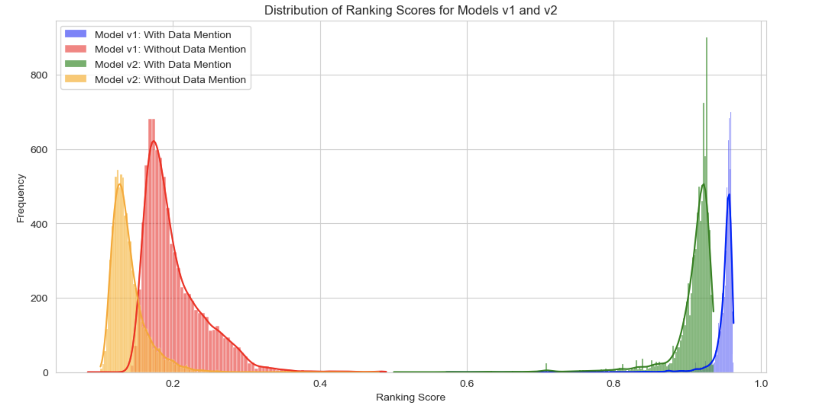

The blue and red histograms (model v1) show the ranking scores for sentences classified as mentioning or not mentioning data, respectively. The blue histogram peaks near a ranking score of 1, which suggests that model v1 has high confidence in its predictions when it classifies a sentence as mentioning data. The red histogram, on the other hand, shows a peak closer to 0, indicating that model v1 is also confident when predicting the absence of data mentions.

The green and orange histograms (model v2) represent the same classifications as the blue and red ones, but for the second model. The green histogram shows that model v2 is very confident for data mentions, with a peak at a ranking score of 1. Similarly, the orange histogram indicates that model v2 has confidence scores peaking near 0 for sentences without data mentions, signifying a high level of confidence in these predictions as well.

Overall, both models show a high degree of confidence in their predictions. The scores are clustered towards the extremes of the scale (near 0 for sentences without data mentions and near 1 for those with data mentions), which generally indicates good model performance. However, there are noticeable differences between the two models:

- Model v2 (green and orange) seems to have a tighter clustering of scores near 1 for data mentions and near 0 for non-mentions compared to model v1 (blue and red). This could imply that model v2 is more confident in its predictions and perhaps better at distinguishing between the two classes than model v1.
- There is a small overlap between the distributions of scores for data mentions and non-mentions for both models, but this overlap is smaller for model v2. A smaller overlap indicates better separation between the classes and suggests better model performance.

## Overall Confidence Distribution 

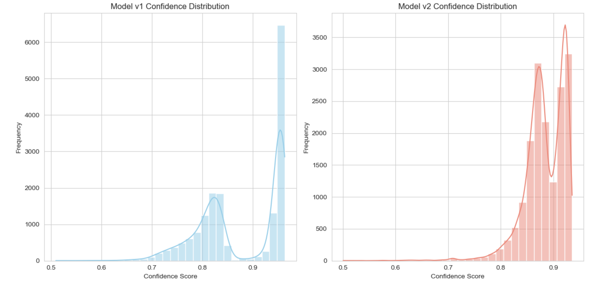

**Model v1 Confidence Distribution**

- The distribution has a large peak at around 0.95 confidence, suggesting that for a substantial portion of the data, the model was quite certain in its predictions.
- There is a small secondary peak around 0.65, indicating a smaller set of predictions where the model was moderately confident.
The distribution is skewed towards the higher confidence scores, which is generally desirable, but only if it correlates with high accuracy.


**Model v2 Confidence Distribution**

- This distribution is bimodal, with two prominent peaks: one near 0.75 and another just below 0.95.
- The presence of the peak around 0.75 suggests that in version 2, there is a significant amount of predictions where the model is less confident compared to the primary peak of version 1.
- The peak just below 0.95 in v2 is not as pronounced as the peak in v1, which might suggest that there are fewer instances where the model is highly confident, or it could indicate that the confidence scores are more spread out.

**Comparative Insights**

The introduction of a new peak at a lower confidence level in v2 might suggest that the additional training data has introduced cases that the model finds less clear-cut, hence the lower confidence. The fact that the high-confidence peak in v2 is less sharp than in v1 might mean that v2 has become more cautious in its predictions, which could be a sign of better calibration if it also corresponds with improved accuracy.

# Confidence Distribution across incorrect and correct predictions

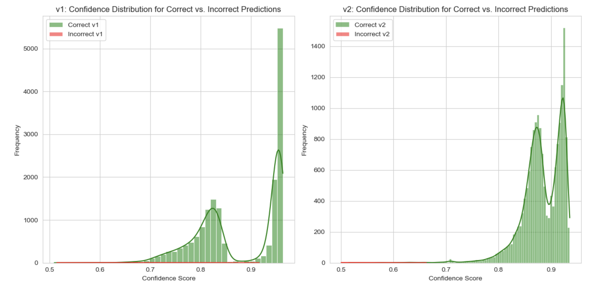

The plots above show the confidence distributions for correct (green) and incorrect (red) predictions for both versions of your model.

Here's what we can observe:

```python
{'high_confidence_incorrect_v1': 1,
 'low_confidence_correct_v1': 26,
 'high_confidence_incorrect_v2': 0,
 'low_confidence_correct_v2': 16}
 ```

- Model v1: In the first version of the model, there is one instance of a high-confidence incorrect prediction (confidence > 0.9). Additionally, there are 26 instances where the model was correct but with low confidence (confidence < 0.6).
- Model v2: In the second version, there are no instances of high-confidence incorrect predictions, which is an improvement. There are fewer instances (16) of correct but low-confidence predictions, which also suggests an improvement in model calibration.


## Accuracy v.s Confidence

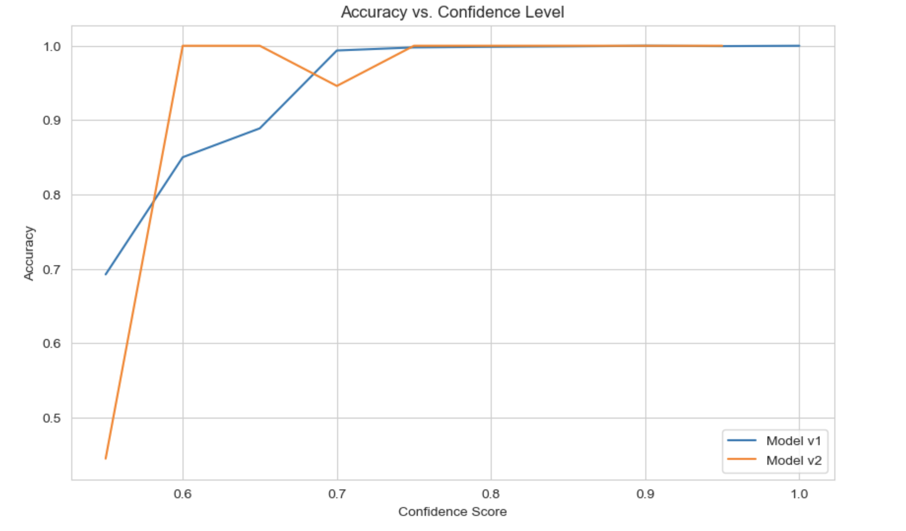

The plot above illustrates how the accuracy of each model version changes with different confidence levels:

- For both models, accuracy tends to increase with confidence, which is expected in well-calibrated models.
- There are some confidence intervals where the accuracy for v2 is slightly lower than for v1, especially in the mid-confidence range (around 0.6 to 0.8). This could suggest that v2 is somewhat less accurate in this range, potentially indicating that the additional data introduced cases that were more challenging for the model.
- At the highest confidence levels (above 0.9), both models seem to perform similarly, maintaining high accuracy.

However, there are fluctuations, particularly in the mid-range, which suggests that the relationship between confidence and accuracy may not be perfectly linear and could benefit from further calibration. It's also worth noting that where there are steep changes or significant fluctuations in accuracy, it could be due to a small number of samples in those confidence bins, which can cause variability.

## Changes in Delta

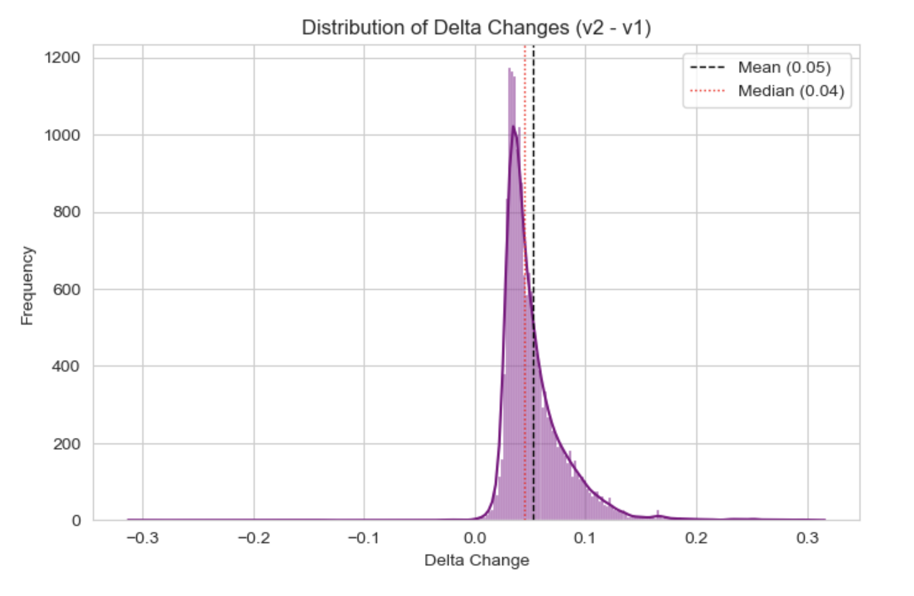

It seems like the Deltas have in general increased. However, we need to evaluate this in conjunction with the new metrics that we obtained, in particular accuracy. V2 has higher accuracy but also a higher $\Delta$ on average, which most likely means that it's just a more "cautious" model. 

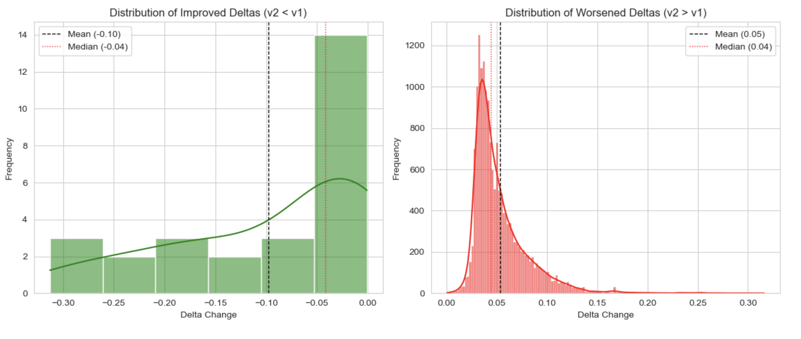

The analysis provides the following insights:

The mean delta improvement (where v2 deltas are lower than v1) is approximately -0.098, and the median improvement is around -0.042. This indicates that for the instances where the model improved, the confidence alignment with the ground truth improved by this amount on average.
Conversely, for instances where the model's performance worsened (v2 deltas are higher than v1), the mean worsening is approximately 0.053, and the median is around 0.044.

Looking at the histograms:

The distribution of improved deltas (green) shows that there are a number of instances where v2 has indeed improved in terms of the delta metric. The plot is skewed to the left, indicating improvements in model confidence alignment with the ground truth for these instances.
The distribution of worsened deltas (red) demonstrates that there are also quite a few instances where v2 performed worse than v1. This plot is skewed to the right, showing that the model's confidence has become less aligned with the ground truth for these instances.
These distributions suggest that while there are cases where v2 has learned from v1's mistakes, there are also new or persisting challenges that have resulted in decreased performance in other instances.


